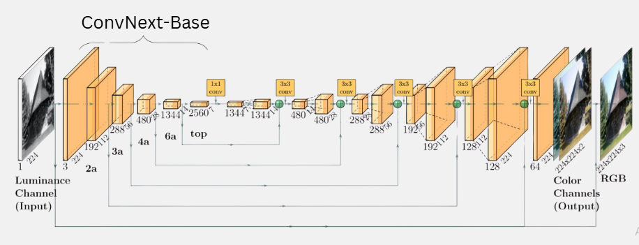
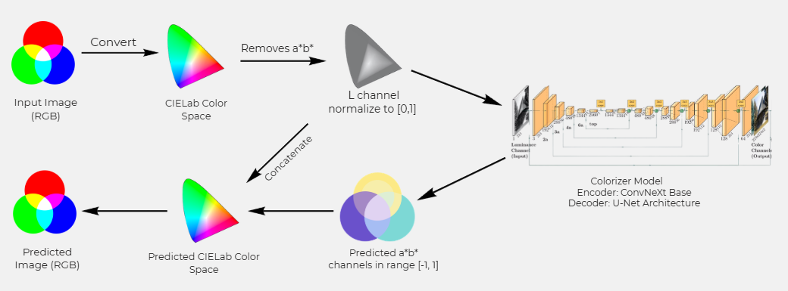
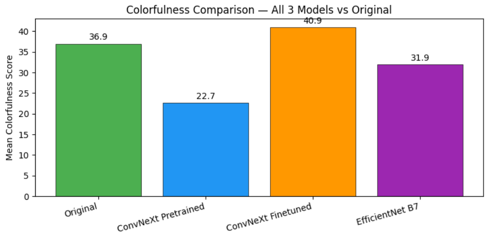
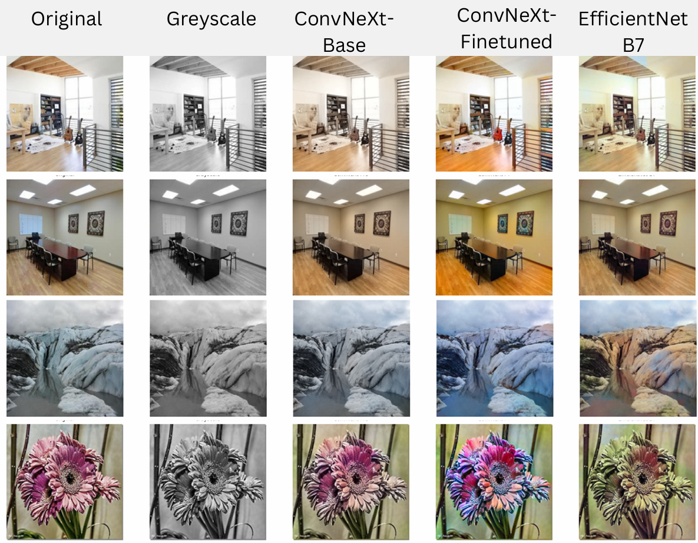
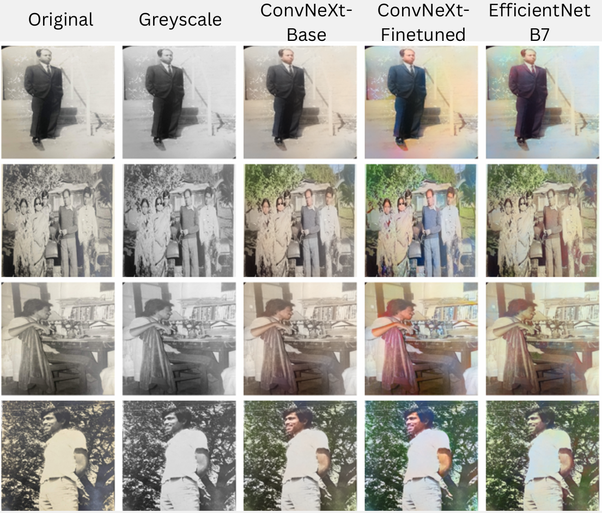

# MemoryLane

> One-click black-and-white photo colorization using deep learning

**CSE330 — Machine Learning Sessional · Jan 2026**

**Team:** Aurchi Chowdhury · Sakif Naieb Raiyan · Sayaad Muzahid Masfi
**Supervisor:** Md Muhaiminul Islam Nafi

---

## Overview

MemoryLane colorizes grayscale photos in the **CIELab color space** — the L\* (luminance) channel goes in, and the model predicts the a\* and b\* (chrominance) channels to produce a full-color image.

This is an inherently ill-posed problem: a single grayscale value can map to many valid colors. Prior work tends to predict the statistical mean across all plausible colors, producing **washed-out, desaturated outputs**. We address this directly.

---

## Our Three Contributions

Built on Lin & Ferreira (2021) — EfficientNet-B7 + U-Net trained on Places365 with MSE loss.

### 1. ConvNeXt-Base Encoder

Replaced the EfficientNet-B7 backbone with **ConvNeXt-Base** for richer semantic features, improving colorization of complex objects like clothing and vehicles.

### 2. Colorfulness Filtering

The raw Places365 dataset (~1.8M images) contains many near-grayscale images that bias the model toward faded predictions. We filtered by **chroma score ≥ 18** and finetuned on the top 28.7% most colorful images (~518K), forcing the model to learn vivid color distributions.

### 3. Multi-Component Loss

Replaced plain MSE with a weighted combination to solve the desaturation problem:

```
L_total = 1.0 · L_mse  +  0.1 · L_perc  +  0.01 · L_adv
```

| Loss | Role |
|------|------|
| **Rebalanced MSE** | Upweights rare colors; counters gray-mean bias |
| **VGG Perceptual** (relu2_2, relu3_3) | Penalizes texture/structure mismatch, prevents blurring |
| **PatchGAN Adversarial** | 70×70 patch critic enforces local realism, prevents artifacts |

The MSE is rebalanced by computing an empirical color distribution over (a, b) space and inversely weighting rare colors — directly countering the model's tendency to predict the statistical mean.

---

## Architecture

| Component | Details |
|-----------|---------|
| **Generator** | ConvNeXt-Base encoder → U-Net decoder with skip connections at each scale |
| **Discriminator** | PatchGAN — 30×30 output, each cell has a 70×70 receptive field |



**Prediction pipeline:**



---

## Training Setup

| | Pre-training | Finetuning |
|--|--------------|------------|
| **Dataset** | Places365 (~1.8M images) | Top 28.7% by colorfulness (~518K) |
| **GPU** | H100 (80 GB) | H100 (80 GB) |
| **Epochs** | 11 | 5 (early stopped) |
| **Batch size** | 32 | — |
| **Generator LR** | `1e-4` | `2e-5` |
| **Discriminator LR** | `2e-4` | `4e-5` |
| **Optimizer** | AdamW (β₁ = 0.5) | AdamW |
| **Total time** | ~35 hrs | — |

---

## Results

Mean colorfulness score (Hasler & Süsstrunk, 2003) averaged across the test set:

| Model | Score |
|-------|-------|
| Ground Truth (original) | 36.9 |
| ConvNeXt pretrained | 22.7 |
| EfficientNet-B7 | 31.9 |
| **ConvNeXt finetuned** | **40.9** |



The finetuned model surpasses ground truth colorfulness, confirming that targeted finetuning on a colorfulness-biased subset is an effective and lightweight strategy for correcting desaturation bias in large-dataset-trained colorization models.

**Test set (Places365):**



**Outside domain (our own family photographs):**



---

## Notebooks

| Notebook | Purpose |
|----------|---------|
| `ml-project.ipynb` | Main training pipeline (ConvNeXt pretrained) |
| `bright-image-ml-project.ipynb` | Finetuning on colorfulness-filtered subset |
| `autocolorization-base-paper.ipynb` | EfficientNet-B7 baseline replication |
| `final-inference-all-3-models.ipynb` | Side-by-side comparison of all three models |
| `inference-demo.ipynb` | Quick inference demo |

---

## Motivation

Just before we were set to submit our project ideas, Sakif's father asked if we could colorize a photo from his first year of university. Although he ended up using a commercial tool, the question sparked this project — we wanted to build our own colorizer capable of breathing new life into old family photos, historical archives, and black-and-white artwork.
